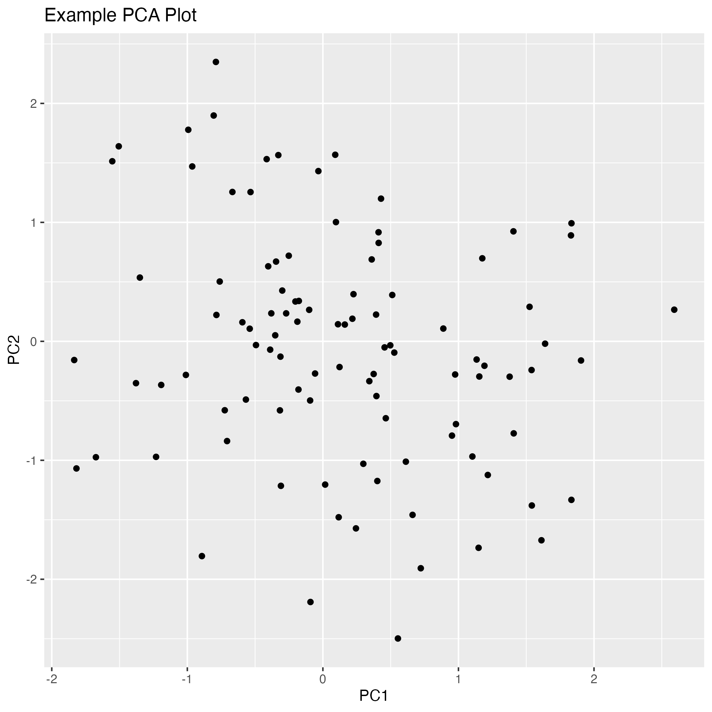

# RareDisease_VariantPipeline

This repository provides a reproducible bioinformatics pipeline for prioritizing rare genetic variants on human chromosome 22 using the 1000 Genomes Project. It includes variant filtering, annotation with Ensembl VEP, and summary analysis and visualization in R.

## Project Structure

```
RareDisease_VariantPipeline/
├── data/              # Raw VCF and index files
├── scripts/           # Shell scripts for each pipeline step
├── results/           # Filtered, annotated variants and plots
├── README.md          # Project documentation
```

## 1. Workflow Overview

This pipeline performs:

- Download and indexing of chromosome 22 VCF data.
- Filtering for `PASS` and rare variants (AF < 0.01).
- Annotation using Ensembl VEP.
- Parsing annotations into tabular format.
- Summary plots and outputs in R.

### Filtered Variants Preview

| CHROM | POS | REF | ALT | SYMBOL | Consequence | IMPACT | Existing_variation | AF |
|-------|-----|-----|-----|--------|--------------|--------|---------------------|----|
| 22 | 16050115 | G | A | . | intergenic_variant | MODIFIER | . | 0.006 |
| 22 | 16050213 | C | T | . | intergenic_variant | MODIFIER | . | 0.007 |

## Example Outputs

### PCA Plot


### MA Plot


## 3. How to Run

### 3.1 Filter VCF

```bash
bash scripts/run_pipeline.sh
```

### 3.2 Annotate with VEP

```bash
vep \
  --input_file results/chr22_rare.vcf.gz \
  --output_file results/chr22_rare_annotated.vcf \
  --vcf \
  --cache \
  --offline \
  --species homo_sapiens \
  --everything \
  --fork 4
```

### 3.3 Extract VEP Annotations

```bash
bcftools +split-vep results/chr22_rare_annotated.vcf \
  -f '%CHROM,%POS,%REF,%ALT,%SYMBOL,%Consequence,%IMPACT,%Existing_variation,%INFO/AF\n' \
  -Ov -o results/chr22_rare_annotated.tsv
```

### 3.4 Analyze and Visualize in R

```r
library(tidyverse)

# Load data
variants <- read_csv("results/chr22_rare_annotated.tsv", col_names = FALSE)
colnames(variants) <- c("CHROM","POS","REF","ALT","SYMBOL","Consequence","IMPACT","Existing_variation","AF")
variants$AF <- as.numeric(variants$AF)

# Filter rare variants
rare_variants <- variants %>% filter(!is.na(AF) & AF < 0.01)
write_csv(rare_variants, "results/chr22_rare_final.csv")

# Allele frequency histogram
ggplot(rare_variants, aes(x = AF)) +
  geom_histogram(bins = 50) +
  labs(title = "Allele Frequency Distribution", x = "AF", y = "Count") +
  xlim(0, 0.05) +
  theme_minimal()
ggsave("results/plots/AF_distribution.png")

# Consequence impact bar plot
ggplot(rare_variants, aes(x = IMPACT)) +
  geom_bar() +
  labs(title = "Consequence Impact Counts", x = "Impact", y = "Count") +
  theme_minimal()
ggsave("results/plots/Impact_counts.png")
```

## 4. Best Practices

- Use `.gitignore` to exclude raw VCFs and large intermediate files.
- Consider using Git LFS for versioning large files.
- Commit only scripts, final clean results, and documentation.


## Author

Muna Berhe — [GitHub Profile](https://github.com/munaberhe)

